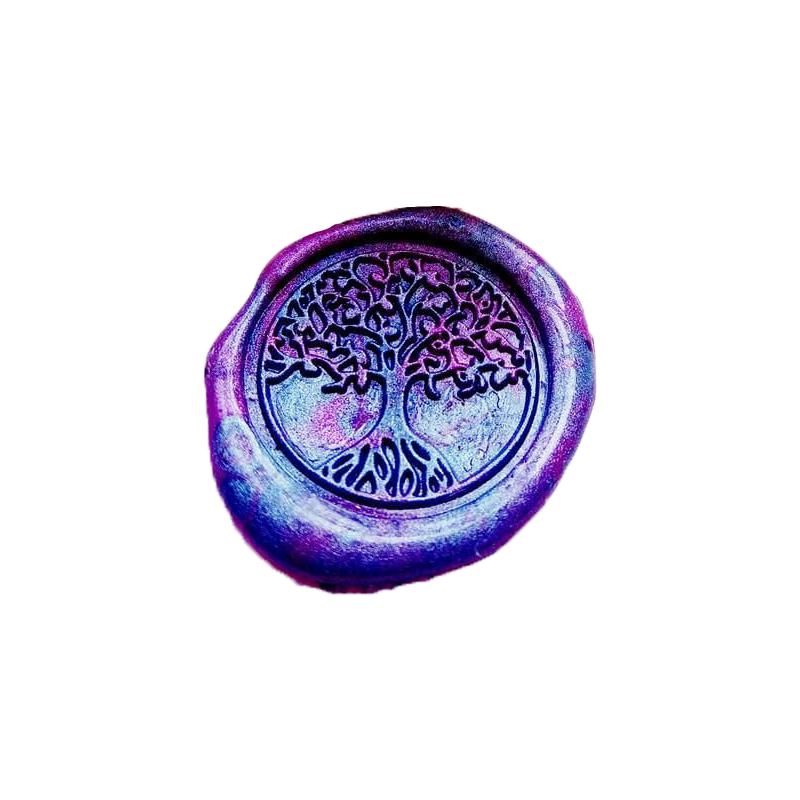

<!-- Banner -->

  

 

##  About Me  

I'm a recent Computer Science & Psychology graduate from the University of Maryland. I enjoy building full-stack applications, backend systems, and data-driven tools that solve practical problems. Currently learning more about cloud architecture, distributed systems, and scalable software design through AWS and personal projects. I'm interested in the intersection of technology and people through software engineering, data, and human-centered design.

---

##  What I'm Working On   

- Learning AWS and cloud architecture
- Building full-stack applications with React, Node.js, Express, and PostgreSQL
- Exploring data engineering and analytics workflows
- Practicing algorithms and system design
- Experimenting with AI applications and RAG systems

---

##  Tech Stack  

### **Languages**
 
 

### **Web & Frameworks**

### **Backend / Tools**

### **Data / ML**
 
 
 
 
 

### **Design**

---

##  Let's Connect!  
 
